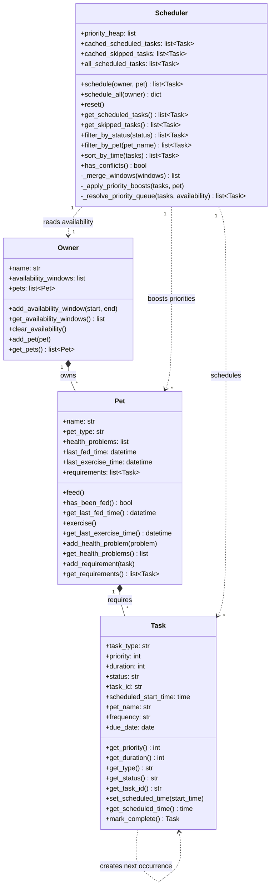

# PawPal+ Class Diagram (Final)

## What changed from Phase 1

| Class | Phase 1 | Final |
|---|---|---|
| `Task` | 4 attributes, `mark_complete()` void | 9 attributes; `mark_complete()` returns new `Task` for recurring tasks |
| `Pet` | `is_fed: bool` boolean flag | `last_fed_time: datetime` timestamp; `add_requirement` auto-sets `pet_name` |
| `Owner` | Single `availability_start/end` pair | `availability_windows: list` supports multiple windows |
| `Scheduler` | 1 attribute, 4 methods | 4 attributes, 11 public + 3 private methods |

## Relationship types used

- `*--` (composition): Owner owns Pets; Pet owns Tasks — if the owner is deleted, their pets and tasks go with them
- `..>` (dependency): Scheduler reads from Owner/Pet/Task but does not own them — it only references them during scheduling

## Class Responsibilities

**Task** — Represents a single pet care activity. Knows its own type, duration, priority, scheduled time, and recurrence frequency. Can self-replicate (return a next occurrence) when marked complete.

**Pet** — Tracks a pet's health, feeding/exercise history, and list of required tasks. Stamps each task with the pet's name when added.

**Owner** — Holds multiple availability windows and a list of pets. The Scheduler reads these windows to know when time slots are available.

**Scheduler** — Orchestrates the full schedule. Uses a min-heap to process tasks by priority, fills shared availability windows across all pets to prevent conflicts, and exposes filtering and sorting helpers for querying the result.

## How to export as PNG

1. Copy the Mermaid code block above
2. Paste into [mermaid.live](https://mermaid.live)
3. Click **Download PNG** → save as `uml_final.png` in this project folder
